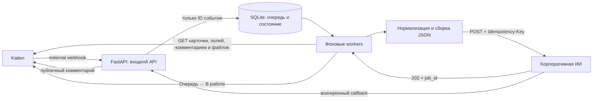

# Архитектура прослойки Kaiten → корпоративная ИИ

## Что это за программа

Это не собственная нейросеть и не замена Kaiten. Это небольшой постоянно
работающий интеграционный сервис, который переводит события Kaiten в понятный
корпоративной ИИ JSON, а затем возвращает результат ИИ в ту же карточку.

Главная идея: webhook используется только как короткий сигнал «что-то
произошло». Сервис не доверяет присланному содержимому и повторно читает
актуальные данные карточки через официальный Kaiten API.



## Из каких частей состоит

| Компонент | Назначение | Основной файл |
|---|---|---|
| HTTP-приложение | Принимает webhook и callback, отдаёт health | `src/kaiten_ai_bridge/app.py` |
| Разбор webhook | Извлекает только тип события, card ID и comment ID | `src/kaiten_ai_bridge/webhook.py` |
| Очередь и состояние | Хранит техническое состояние в SQLite | `src/kaiten_ai_bridge/storage.py` |
| Оркестратор | Выполняет события, повторы, сверку и очистку | `src/kaiten_ai_bridge/service.py` |
| Kaiten-клиент | Читает карточки/справочники/файлы, пишет комментарии и перемещает карточки | `src/kaiten_ai_bridge/kaiten.py` |
| Преобразование данных | Нормализует поля, строит Markdown и JSON | `src/kaiten_ai_bridge/domain.py` |
| Клиент корпоративной ИИ | Отправляет JSON и проверяет `202 + job_id` | `src/kaiten_ai_bridge/receiver.py` |
| Настройки | Проверяет переменные окружения `BRIDGE_*` | `src/kaiten_ai_bridge/config.py` |
| Диагностическая выгрузка | Read-only проверка экстрактора без webhook | `src/kaiten_ai_bridge/probe.py` |
| Тестовый получатель | Перехватывает реальный исходящий JSON локально | `src/kaiten_ai_bridge/capture.py` |

## Что используется

- **Python 3.11+** — язык и среда выполнения.
- **FastAPI** — HTTP endpoints для Kaiten и callback корпоративной ИИ.
- **Uvicorn** — HTTP-сервер приложения.
- **HTTPX** — асинхронные обращения к Kaiten и получателю ИИ.
- **Pydantic / pydantic-settings** — проверка входных контрактов и конфигурации.
- **SQLite + aiosqlite** — локальная надёжная очередь без отдельного сервера БД.
- **Pytest, pytest-asyncio, respx** — автоматические тесты.
- **Ruff** — проверка качества и форматирование Python-кода.
- **systemd или Docker** — варианты постоянного запуска на Ubuntu.
- **nginx** — рекомендуемый внешний reverse proxy в production.
- **Cloudflare Quick Tunnel** — только временный публичный URL для локального
  теста на компьютере.

RTX 4090 программе не нужна: здесь нет локальной генеративной модели. Основная
нагрузка — HTTP-запросы, SQLite, преобразование текста и Base64-кодирование
файлов. Для production достаточно небольшого CPU-сервера, если размеры файлов и
число одновременных карточек умеренные.

## Как обрабатывается новая карточка

1. Kaiten отправляет событие `card:add` на `/webhooks/kaiten`.
2. Сервис извлекает из тела только `event_type` и `card_id`.
3. Событие записывается в SQLite с уникальным ключом `card:add:<card_id>`.
4. Только после надёжной записи сервис отвечает Kaiten кодом `202`.
5. Фоновый worker берёт событие и повторно читает карточку через Kaiten API.
6. Проверяется, что карточка относится именно к настроенным пространству,
   доске и Service Desk service и находится в колонке `Очередь`.
7. Динамически читаются custom properties и справочники select, catalog и user.
   Новые поля и новые значения не требуют изменения исходного кода.
8. Читаются пользовательские стартовые комментарии и подходящие вложения.
   Для исходного Service Desk-описания признаком происхождения служит
   `sd_description`, поэтому оно не отбрасывается, даже если Kaiten указал
   автором тот же аккаунт, чей API-токен использует прослойка.
9. Все файлы сначала проверяются по расширению и размеру. Если один файл не
   проходит проверку, не отправляется вся заявка.
10. Формируется Markdown-промпт с фиксированными разделами и исходящий JSON.
11. JSON отправляется корпоративной ИИ. В заголовке передаётся тот же
    `Idempotency-Key`, что находится внутри JSON.
12. Получатель должен ответить строго `202 Accepted` и вернуть `job_id`.
13. Связь `card_id ↔ job_id` сохраняется в SQLite, после чего карточка
    перемещается из `Очереди` в `В работе`.

Сокращённая форма исходящего сообщения:

```json
{
  "schema_version": 1,
  "event_type": "initial",
  "idempotency_key": "card:add:123",
  "card": {
    "id": 123,
    "url": "https://example.kaiten.ru/space/.../card/123"
  },
  "comment_id": null,
  "ai_job_id": null,
  "request_type": "значение поля Тип заявки",
  "prompt": "# Заявка в корпоративную ИИ\n...",
  "files": [
    {
      "name": "document.xlsx",
      "mime_type": "application/vnd.openxmlformats-officedocument.spreadsheetml.sheet",
      "size": 20381,
      "sha256": "...",
      "content_base64": "..."
    }
  ],
  "created_at": "2026-09-03T00:00:00Z"
}
```

## Как обрабатывается новый комментарий

1. Kaiten отправляет `comment:add` с `card_id` и `comment_id`.
2. Технические, внутренние, удалённые и стартовые Service Desk комментарии
   игнорируются.
3. Комментарии одной карточки выполняются строго в порядке их создания. Перед
   ними всегда завершается начальное событие карточки. Разные карточки могут
   обрабатываться параллельно.
4. Сервис повторно читает комментарий и его файлы из Kaiten.
5. Формируется JSON с `event_type=comment`, `comment_id` и существующим
   `ai_job_id`.
6. JSON отправляется тому же получателю как продолжение уже созданной задачи ИИ.

Если webhook новой карточки потерялся, но первым пришёл комментарий, сервис
восстанавливает начальное событие и ставит его впереди комментария.

Незавершённый `card:add` имеет безусловный приоритет перед всеми комментариями
той же карточки. Это важно для Service Desk: Kaiten может отправить
`comment:add` на несколько миллисекунд раньше `card:add` или присвоить им
одинаковый source timestamp. Комментарий не должен занять очередь до создания
задачи ИИ.

Отдельный `comment:add` исходного `sd_description` всегда игнорируется: его текст
и файлы уже вошли в начальный JSON. Обычные комментарии API-пользователя также
считаются техническими. Это сохраняет защиту от цикла, когда опубликованный
прослойкой результат снова приходит ей как новый webhook.

## Как возвращается результат ИИ

Корпоративная ИИ отправляет callback на `/callbacks/corporate-ai`:

1. Проверяется Bearer-токен callback.
2. Проверяются версия схемы, статус, `result_id`, `job_id` и содержимое ответа.
3. По `job_id` находится исходная карточка.
4. `result_id` резервируется в SQLite, чтобы повторный callback не создал второй
   комментарий.
5. Текст результата публикуется в Kaiten как публичный комментарий.
6. Успешная публикация фиксируется в SQLite.

Полученный callback сам по себе не переносит карточку в `Готово`. Карточка
остаётся доступной для диалога. По текущему lifecycle через 29 дней без
активности публикуется предупреждение, а через 30 дней карточка переносится в
`Готово` и её локальное рабочее состояние удаляется.

Файлы результата в callback пока намеренно отклоняются с `422`, потому что в ТЗ
не согласованы формат передачи и способ загрузки таких файлов обратно в Kaiten.

## Что хранится в SQLite

SQLite хранит только минимальное техническое состояние:

- тип события и технические ID карточки/комментария;
- идемпотентный ключ и статус обработки;
- число попыток, время следующего повтора и безопасный код ошибки;
- связь `card_id ↔ job_id`;
- обработанные `result_id` callback;
- технические timestamps health, reconciliation и cleanup.

В базе не хранятся тела webhook и callback, тексты карточек и комментариев,
промпты, значения полей, имена файлов, Base64 и временные ссылки.

## Работа с файлами

- Разрешённые расширения и максимальный размер задаются конфигурацией.
- По умолчанию лимит одного файла — 5 MiB.
- Файл скачивается потоково во временный файл с закрытыми правами.
- Размер проверяется по метаданным, HTTP-заголовку и фактически полученным
  байтам.
- После чтения вычисляется SHA-256 и содержимое кодируется в Base64.
- Временный файл удаляется в `finally`, в том числе при ошибке.
- Kaiten Bearer не пересылается на подписанный URL файлового хранилища.
- Каждый redirect файла заново проверяется; локальные и private IP запрещены.

Base64 увеличивает объём примерно на треть, поэтому в production нужен отдельный
лимит всего HTTP-тела, согласованный с корпоративной ИИ и reverse proxy.

## Надёжность и повторная обработка

- Webhook подтверждается только после записи в SQLite.
- Уникальный `event_key` защищает от повторных webhook.
- При временной ошибке событие повторяется по расписанию
  `0, 2, 5, 10, 20, 40, 80, 150, 300` секунд.
- После перезапуска незавершённые события возвращаются в обработку.
- Порядок сохраняется отдельно для каждой карточки.
- Контрольная сверка по умолчанию запускается раз в шесть часов и восстанавливает
  потерянные события.
- Ежедневная очистка удаляет устаревшие технические ключи, временные файлы и
  ротированные журналы.

Есть известное production-ограничение: между успешной публикацией callback в
Kaiten и фиксацией этого факта в SQLite остаётся небольшое аварийное окно. При
падении процесса ровно в этот момент возможен повтор комментария. Для строгой
exactly-once гарантии требуется дополнительный идемпотентный механизм на стороне
Kaiten или согласованный маркер результата.

## Безопасность

- Все секреты передаются только через переменные окружения.
- Pydantic хранит токены как `SecretStr` и не показывает их в `repr`.
- Журналы используют allowlist технических полей и не пишут пользовательское
  содержимое.
- Callback защищён отдельным Bearer-токеном.
- Исходящий запрос к ИИ защищён Bearer-токеном и идемпотентным заголовком.
- Входной Kaiten webhook сейчас не имеет собственной подписи или Bearer-защиты.
  Поэтому production endpoint нужно размещать за HTTPS reverse proxy, ограничить
  доступ доступными средствами инфраструктуры и не использовать временный
  `trycloudflare.com` адрес как постоянный.
- Даже при поддельном webhook сервис не принимает из него текст: он берёт только
  ID и затем проверяет карточку через авторизованный Kaiten API и заданный scope.

## Локальный тест и production

В локальном тесте корпоративную ИИ заменяет `capture.py`. Он слушает только
`127.0.0.1:8090`, проверяет Bearer и `Idempotency-Key`, отвечает
`202 + local job_id` и сохраняет фактически полученное тело в `data/captures`.
Это позволяет проверить весь путь до HTTP-получателя без реальной ИИ.

Cloudflare Quick Tunnel временно публикует локальный порт `8080`, чтобы Kaiten
мог отправить внешний webhook на компьютер. Адрес меняется после перезапуска и
не имеет SLA.

В production вместо этого нужны:

- постоянно работающий Ubuntu-сервер;
- systemd либо Docker;
- постоянный домен и TLS;
- nginx/reverse proxy с лимитами тела и журналами без содержимого;
- реальный endpoint корпоративной ИИ;
- секреты из защищённого хранилища;
- мониторинг `/health`, резервирование SQLite и проверка восстановления после
  перезапуска.

Минимальный VPS с 1 vCPU и 1 GiB RAM подходит для пилота при небольшом потоке.
Основное ограничение — дисковое место и размеры одновременно скачиваемых файлов,
а не вычисления ИИ.
